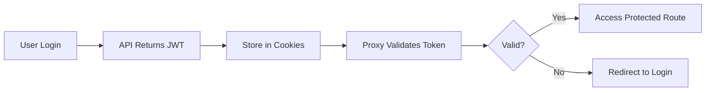

# Next.js Enterprise Authentication Starter

> A production-ready Next.js 16 starter template with complete authentication, role-based access control (RBAC), and permission management system.

[](https://nextjs.org/)
[](https://www.typescriptlang.org/)
[](LICENSE)

## 🌟 Features

- ✅ **Next.js 16** - Latest App Router with Server Components
- 🔐 **Complete Authentication** - Login, Register, Logout with JWT
- 🛡️ **Authorization System** - Role-based & Permission-based access control
- 🚀 **Proxy Middleware** - Server-side route protection (Next.js 16 standard)
- 🎨 **Tailwind CSS v4** - Latest styling with `@tailwindcss/postcss`
- 📦 **TypeScript** - Full type safety
- 🔄 **Token Management** - Automatic refresh & secure storage
- 🎯 **Flexible API Integration** - Easy to adapt to any backend
- 📱 **Responsive Design** - Mobile-first approach
- 🧩 **Reusable Components** - Auth guards, permission boundaries
- 🔧 **Environment Config** - All settings via .env

## 📋 Table of Contents

- [Quick Start](#-quick-start)
- [Project Structure](#-project-structure)
- [Authentication Flow](#-authentication-flow)
- [Customization Guide](#-customization-guide)
- [Adding Protected Routes](#-adding-protected-routes)
- [Permission System](#-permission-system)
- [API Reference](#-api-reference)
- [Deployment](#-deployment)
- [Troubleshooting](#-troubleshooting)

---

## 🚀 Quick Start

## 🚀 Quick Start

### Prerequisites

- Node.js 18+
- pnpm (recommended) or npm

### Installation

```bash
# 1. Clone the repository
git clone <your-repo-url>
cd nextjs

# 2. Install dependencies
pnpm install

# 3. Setup environment variables
cp .env.example .env.local

# 4. Update .env.local with your API URL
# NEXT_PUBLIC_API_URL=http://localhost:5000/v1

# 5. Start development server
pnpm dev
```

Open [http://localhost:3000](http://localhost:3000) in your browser.

### Default Routes

- `/` - Home page (public)
- `/login` - Login page
- `/register` - Register page
- `/dashboard` - Protected dashboard (requires authentication)

---

## 📁 Project Structure

```
nextjs/
├── src/
│   ├── app/                          # Next.js App Router
│   │   ├── (public)/                 # Public route group
│   │   │   ├── login/                # Login page
│   │   │   └── register/             # Register page
│   │   ├── (protected)/              # Protected route group
│   │   │   ├── dashboard/            # Dashboard page
│   │   │   └── layout.tsx            # Protected layout with auth check
│   │   ├── components/               # React components
│   │   │   ├── auth/                 # Auth-related components
│   │   │   │   ├── auth-guard.tsx    # Client-side auth guard
│   │   │   │   └── permission-boundary.tsx
│   │   │   └── shared/               # Shared components
│   │   ├── providers/                # Context providers
│   │   └── styles/                   # Global styles
│   │
│   ├── lib/                          # Library code
│   │   ├── api/                      # API client setup
│   │   │   ├── client/               # Axios instance & interceptors
│   │   │   ├── endpoints/            # API endpoint definitions
│   │   │   │   └── auth.ts           # 👈 Customize for your API
│   │   │   └── utils/                # API utilities
│   │   │
│   │   ├── auth/                     # Authentication system
│   │   │   ├── constants/            # Auth constants
│   │   │   │   ├── permissions.ts    # Permission definitions
│   │   │   │   ├── roles.ts          # Role definitions
│   │   │   │   └── routes.ts         # 👈 Add your routes here
│   │   │   ├── core/                 # Core auth logic
│   │   │   │   ├── token-manager.ts  # 👈 JWT handling
│   │   │   │   └── session-validator.ts
│   │   │   ├── hooks/                # React hooks
│   │   │   │   ├── use-auth.ts       # Main auth hook
│   │   │   │   ├── use-permissions.ts
│   │   │   │   └── use-roles.ts
│   │   │   ├── middleware/           # Auth middleware
│   │   │   │   └── auth-middleware.ts # 👈 Route protection logic
│   │   │   └── guards/               # Server-side guards
│   │   │
│   │   └── utils/                    # Utility functions
│   │       ├── storage/              # Storage utilities
│   │       └── validation/           # Validation schemas
│   │
│   └── proxy.ts                      # 👈 Next.js 16 proxy (replaces middleware)
│
├── public/                           # Static assets
├── .env.local                        # 👈 Environment variables (create this)
├── .env.example                      # Environment template
├── package.json                      # Dependencies
├── tsconfig.json                     # TypeScript config
├── tailwind.config.ts                # Tailwind config
└── next.config.ts                    # Next.js config
```

**Key Files to Customize:**

- `src/lib/api/endpoints/auth.ts` - Adapt to your API response format
- `src/lib/auth/core/token-manager.ts` - Adjust JWT structure
- `src/lib/auth/constants/routes.ts` - Add your protected routes
- `src/lib/auth/constants/permissions.ts` - Define your permissions
- `src/proxy.ts` - Already configured (Next.js 16 standard)

---

## 🔐 Authentication Flow

### How It Works



1. **User logs in** with email & password
2. **API returns** JWT access token + refresh token
3. **Tokens stored** in browser cookies (readable by server)
4. **Proxy middleware** (`src/proxy.ts`) validates token on every request
5. **Protected routes** automatically check authentication
6. **Token decoded** and user info added to request headers

### Expected API Response Format

Your backend API should return this format for `/auth/login` and `/auth/register`:

```json
{
  "message": "Successfully logged in",
  "data": {
    "access_token": "eyJhbGciOiJIUzI1NiIsInR5cCI6IkpXVCJ9...",
    "refresh_token": "eyJhbGciOiJIUzI1NiIsInR5cCI6IkpXVCJ9...",
    "expires_in": 3600,
    "user": {
      "id": "user-123",
      "name": "John Doe",
      "email": "john@example.com",
      "role": "customer",
      "status": "verified",
      "photo": null
    }
  },
  "success": true,
  "timestamp": "2025-12-30T19:34:29.024Z"
}
```

### JWT Token Structure

Your JWT should contain these fields (customize if different):

```json
{
  "id": "user-123",
  "name": "John Doe",
  "email": "john@example.com",
  "role": "customer",
  "permissions": ["feature:view", "feature:create"],
  "iat": 1767123269,
  "exp": 1767126869
}
```

---

## 🔧 Customization Guide

### Scenario 1: Your API Response Format is Different

**Example:** Your API returns different field names:

```json
{
  "token": "jwt_token",
  "refreshToken": "refresh_token",
  "expiresIn": 3600
}
```

**Solution:** Update `src/lib/api/endpoints/auth.ts`

```typescript
export const authApi = {
  login: async (data: LoginRequest): Promise<ILoginResponse> => {
    const validated = LoginSchema.parse(data);
    const response = await apiClient.post<YourApiResponse>(
      '/auth/login',
      validated
    );

    // transform YOUR API response to match internal format
    return {
      access_token: response.data.token,
      refresh_token: response.data.refreshToken,
      expires_in: response.data.expiresIn,
      user: response.data.user,
    };
  },
};
```

### Scenario 2: Different JWT Structure

**Example:** Your JWT contains different fields:

```json
{
  "userId": "123", // instead of "id"
  "userRole": "admin", // instead of "role"
  "exp": 1234567890
}
```

**Solution:** Update `src/lib/auth/core/token-manager.ts`

```typescript
export interface IDecodedToken extends IJwtPayload {
  userId: string; // Change from 'id'
  email: string;
  name: string;
  userRole: string; // Change from 'role'
  permissions?: string[];
}
```

Then update middleware at `src/lib/auth/middleware/auth-middleware.ts`:

```typescript
const decoded = jwtDecode<{
  userId: string; // Match your JWT structure
  userRole: string;
  permissions?: string[];
}>(token);

// Update header setting
headers.set('x-user-id', user.userId || ''); // Use userId
headers.set('x-user-role', user.userRole || ''); // Use userRole
```

---

## 🛡️ Adding Protected Routes

### Step 1: Create Your Route

Create folder structure:

```
src/app/(protected)/
  └── my-feature/
      └── page.tsx
```

### Step 2: Register Route as Protected

Edit `src/lib/auth/constants/routes.ts`:

```typescript
export const PROTECTED_ROUTES = [
  '/dashboard',
  '/profile',
  '/settings',
  '/my-feature', // Add your route
  '/api/protected',
];
```

### Step 3: Create Your Page Component

`src/app/(protected)/my-feature/page.tsx`:

```tsx
export default function MyFeaturePage() {
  return (
    <div>
      <h1>My Protected Feature</h1>
      <p>Only authenticated users can see this</p>
    </div>
  );
}
```

**That's it!** The proxy middleware automatically protects it.

---

## 🔐 Permission System

### Step 1: Define Permissions

Edit `src/lib/auth/constants/permissions.ts`:

```typescript
export const PERMISSIONS = {
  // User Management
  USER_VIEW: 'user:view',
  USER_CREATE: 'user:create',
  USER_EDIT: 'user:edit',
  USER_DELETE: 'user:delete',

  // Your Feature
  FEATURE_VIEW: 'feature:view',
  FEATURE_CREATE: 'feature:create',
  FEATURE_EDIT: 'feature:edit',
  FEATURE_DELETE: 'feature:delete',
};
```

### Step 2: Your API Must Return Permissions

Ensure your JWT token includes permissions array:

```json
{
  "id": "user-id",
  "role": "manager",
  "permissions": ["feature:view", "feature:create", "feature:edit"]
}
```

If your API doesn't return permissions in JWT, you can:

**Option A:** Map role to permissions (simple approach)

Edit `src/lib/auth/hooks/use-permissions.ts`:

```typescript
// Add at the top of usePermissions hook
useEffect(() => {
  if (user && !user.permissions) {
    // Map roles to permissions
    const rolePermissions = {
      admin: ['user:view', 'user:create', 'user:edit', 'user:delete'],
      manager: ['user:view', 'feature:view', 'feature:create'],
      customer: ['feature:view'],
    };

    user.permissions = rolePermissions[user.role] || [];
  }
}, [user]);
```

**Option B:** Fetch permissions from API after login

Update `src/lib/auth/hooks/use-auth.ts`:

```typescript
const login = useCallback(async (email: string, password: string) => {
  setIsLoading(true);
  try {
    const response = await authApi.login({ email, password });

    await tokenManager.setTokens({
      accessToken: response.access_token,
      refreshToken: response.refresh_token,
      expiresAt: Date.now() + response.expires_in * 1000,
    });

    // Fetch user permissions from API
    const permissions = await apiClient.get('/user/permissions');

    const userData = tokenManager.decodeToken(response.access_token);
    if (userData) {
      userData.permissions = permissions.data;
    }
    setUser(userData);

    // ... rest of code
  }
});
```

---

## 🎨 UI Protection Examples

### Method 1: Using Hooks (Recommended)

```tsx
'use client';

import { usePermissions } from '@/lib/auth/hooks/use-permissions';
import { PERMISSIONS } from '@/lib/auth/constants/permissions';

export default function MyComponent() {
  const { hasPermission } = usePermissions();

  return (
    <div>
      <h1>Feature Management</h1>

      {/* Show button only if user has permission */}
      {hasPermission(PERMISSIONS.FEATURE_CREATE) && (
        <button onClick={handleCreate}>Create New</button>
      )}

      {/* Show edit button only if user has permission */}
      {hasPermission(PERMISSIONS.FEATURE_EDIT) && (
        <button onClick={handleEdit}>Edit</button>
      )}

      {/* Show delete button only if user has permission */}
      {hasPermission(PERMISSIONS.FEATURE_DELETE) && (
        <button onClick={handleDelete}>Delete</button>
      )}
    </div>
  );
}
```

### Method 2: Using PermissionBoundary Component

```tsx
'use client';

import { PermissionBoundary } from '@/app/components/auth/permission-boundary';

export default function MyComponent() {
  return (
    <div>
      <h1>Feature Management</h1>

      <PermissionBoundary
        resource='feature'
        action='create'
        fallback={<p>No permission to create</p>}
      >
        <button onClick={handleCreate}>Create New</button>
      </PermissionBoundary>

      <PermissionBoundary resource='feature' action='edit'>
        <button onClick={handleEdit}>Edit</button>
      </PermissionBoundary>

      <PermissionBoundary resource='feature' action='delete'>
        <button onClick={handleDelete}>Delete</button>
      </PermissionBoundary>
    </div>
  );
}
```

### Method 3: Multiple Permissions Check

```tsx
'use client';

import { useAuth } from '@/lib/auth/hooks/use-auth';

export default function MyComponent() {
  const { hasAnyPermission, hasAllPermissions } = useAuth();

  return (
    <div>
      {/* Show if user has ANY of these permissions */}
      {hasAnyPermission(['feature:edit', 'feature:delete']) && (
        <div>
          <h2>Management Actions</h2>
          {/* management buttons */}
        </div>
      )}

      {/* Show if user has ALL of these permissions */}
      {hasAllPermissions(['feature:view', 'feature:export']) && (
        <button onClick={handleExport}>Export Data</button>
      )}
    </div>
  );
}
```

---

## 👥 Role-Based UI Control

### Simple Role Check

```tsx
'use client';

import { useAuth } from '@/lib/auth/hooks/use-auth';

export default function MyComponent() {
  const { user, hasRole } = useAuth();

  return (
    <div>
      {/* Show for specific role */}
      {hasRole('admin') && (
        <button onClick={handleAdminAction}>Admin Panel</button>
      )}

      {/* Show for multiple roles */}
      {(hasRole('admin') || hasRole('manager')) && (
        <div>Management Dashboard</div>
      )}

      {/* Show based on user role */}
      {user?.role === 'customer' && <div>Customer View</div>}
    </div>
  );
}
```

---

## 🚨 Advanced: Custom Route Guard

### Protecting Specific Routes with Custom Logic

Create `src/app/(protected)/admin/layout.tsx`:

```tsx
import { headers } from 'next/headers';
import { redirect } from 'next/navigation';

export default async function AdminLayout({
  children,
}: {
  children: React.ReactNode;
}) {
  const headersList = await headers();
  const userRole = headersList.get('x-user-role');

  // Only admins can access
  if (userRole !== 'admin' && userRole !== 'super_admin') {
    redirect('/unauthorized');
  }

  return <>{children}</>;
}
```

### Add to Route Constants

Edit `src/lib/auth/constants/routes.ts`:

```typescript
export const ADMIN_ROUTES = [
  '/admin',
  '/admin/users',
  '/admin/products',
  '/admin/my-feature', // Add your admin route
];
```

---

## 📦 Complete Example: Products Feature

### 1. Add Route & Permissions

`src/lib/auth/constants/permissions.ts`:

```typescript
export const PERMISSIONS = {
  // ... existing
  PRODUCT_VIEW: 'product:view',
  PRODUCT_CREATE: 'product:create',
  PRODUCT_EDIT: 'product:edit',
  PRODUCT_DELETE: 'product:delete',
};
```

`src/lib/auth/constants/routes.ts`:

```typescript
export const PROTECTED_ROUTES = [
  // ... existing
  '/products',
];
```

### 2. Create Page Component

`src/app/(protected)/products/page.tsx`:

```tsx
'use client';

import { usePermissions } from '@/lib/auth/hooks/use-permissions';
import { PERMISSIONS } from '@/lib/auth/constants/permissions';

export default function ProductsPage() {
  const { hasPermission } = usePermissions();

  return (
    <div className='p-8'>
      <div className='flex justify-between items-center mb-6'>
        <h1 className='text-2xl font-bold'>Products</h1>

        {hasPermission(PERMISSIONS.PRODUCT_CREATE) && (
          <button
            className='bg-blue-500 text-white px-4 py-2 rounded'
            onClick={() => console.log('Create product')}
          >
            Add Product
          </button>
        )}
      </div>

      <table className='w-full'>
        <thead>
          <tr>
            <th>Name</th>
            <th>Price</th>
            <th>Actions</th>
          </tr>
        </thead>
        <tbody>
          <tr>
            <td>Product 1</td>
            <td>$100</td>
            <td>
              {hasPermission(PERMISSIONS.PRODUCT_EDIT) && (
                <button onClick={() => console.log('Edit')}>Edit</button>
              )}
              {hasPermission(PERMISSIONS.PRODUCT_DELETE) && (
                <button onClick={() => console.log('Delete')}>Delete</button>
              )}
            </td>
          </tr>
        </tbody>
      </table>
    </div>
  );
}
```

### 3. Add Navigation Link (if needed)

`src/app/components/shared/navigation.tsx`:

```tsx
import { PERMISSIONS } from '@/lib/auth/constants/permissions';

// Inside component
{
  hasPermission(PERMISSIONS.PRODUCT_VIEW) && (
    <Link href='/products'>Products</Link>
  );
}
```

---

## 🐛 Troubleshooting

### Issue 1: "Access Denied" after login

**Cause:** JWT token structure doesn't match `IDecodedToken` interface  
**Solution:** Check your JWT payload and update `token-manager.ts` interface

### Issue 2: Permissions not working

**Cause:** JWT doesn't include `permissions` array  
**Solution:** Either:

- Update your backend to include permissions in JWT
- Map roles to permissions on frontend (see "Permission-Based Access Control")

### Issue 3: Redirect loop after login

**Cause:** Route matching issue  
**Solution:** Already fixed - routes use exact matching

### Issue 4: Cookies not working

**Cause:** `httpOnly` flag cannot be set from client  
**Solution:** Already fixed - removed `httpOnly` flag

---

## 📚 API Reference

### useAuth Hook

```typescript
const {
  user, // Current user object
  isLoading, // Loading state
  isAuthenticated, // Is user logged in
  login, // Login function
  logout, // Logout function
  hasPermission, // Check single permission
  hasRole, // Check user role
  hasAnyPermission, // Check if has any of permissions
  hasAllPermissions, // Check if has all permissions
} = useAuth();
```

### usePermissions Hook

```typescript
const {
  user, // Current user object
  hasPermission, // Check permission
  canView, // Check view permission
  canCreate, // Check create permission
  canEdit, // Check edit permission
  canDelete, // Check delete permission
  canExport, // Check export permission
  canManage, // Check manage permission
} = usePermissions();
```

---

## ✅ Best Practices

1. **Always define permissions as constants** - Don't use magic strings
2. **Check permissions on both client AND server** - Client for UI, server for security
3. **Use TypeScript interfaces** - Helps catch type errors early
4. **Test with different roles** - Create test users with different permissions
5. **Handle loading states** - Show loading spinner while checking auth
6. **Provide fallback UI** - Show meaningful messages when access is denied

---

## 🚀 Deployment

### Environment Variables

Create `.env.production`:

```env
NODE_ENV=production
NEXT_PUBLIC_API_URL=https://api.yourapp.com/v1
NEXT_PUBLIC_APP_VERSION=1.0.0
NEXT_PUBLIC_API_TIMEOUT=30000
NEXT_PUBLIC_REFRESH_TOKEN_EXPIRY=604800
```

### Build & Deploy

```bash
# Build for production
pnpm build

# Start production server
pnpm start

# Or deploy to Vercel (recommended)
vercel deploy --prod
```

### Deployment Checklist

- [ ] Update `NEXT_PUBLIC_API_URL` in production `.env`
- [ ] Ensure JWT includes all required fields (`id`, `role`, `email`)
- [ ] Set secure cookies in production (already configured)
- [ ] Test all protected routes
- [ ] Test all permission checks
- [ ] Verify logout clears all cookies
- [ ] Check redirect flows work correctly

---

## 🛠️ Available Scripts

```bash
# Development
pnpm dev              # Start dev server at localhost:3000
pnpm build            # Build for production
pnpm start            # Start production server

# Code Quality
pnpm lint             # Run ESLint
pnpm type-check       # Run TypeScript compiler check

# Testing (if configured)
pnpm test             # Run tests
pnpm test:watch       # Run tests in watch mode
```

---

## 🤝 Contributing

Contributions are welcome! Please follow these steps:

1. Fork the repository
2. Create a feature branch (`git checkout -b feature/amazing-feature`)
3. Commit your changes (`git commit -m 'Add amazing feature'`)
4. Push to the branch (`git push origin feature/amazing-feature`)
5. Open a Pull Request

---

## 📄 License

This project is licensed under the MIT License - see the [LICENSE](LICENSE) file for details.

---

## 💬 Support & Contact

- **Developer:** Muhammad Asif
- **Website:** [muhammadasif.vercel.app](https://muhammadasif.vercel.app)

### Need Help?

### Need Help?

- 🐛 Check browser console for client-side errors
- 📝 Check dev server terminal for middleware logs
- 🔍 Verify JWT structure using [jwt.io](https://jwt.io)
- 📧 Ensure API response matches expected format
- 💬 Contact: [muhammadasif.vercel.app](https://muhammadasif.vercel.app)

---

## ⭐ Show Your Support

If this starter helped you, please give it a ⭐️ on GitHub!

---

## 🙏 Acknowledgments

- [Next.js](https://nextjs.org/) - The React Framework
- [Tailwind CSS](https://tailwindcss.com/) - Utility-first CSS framework
- [TypeScript](https://www.typescriptlang.org/) - Typed JavaScript
- [Axios](https://axios-http.com/) - HTTP client
- [jwt-decode](https://github.com/auth0/jwt-decode) - JWT decoder

---

**Built with ❤️ by [Muhammad Asif](https://muhammadasif.vercel.app)**
